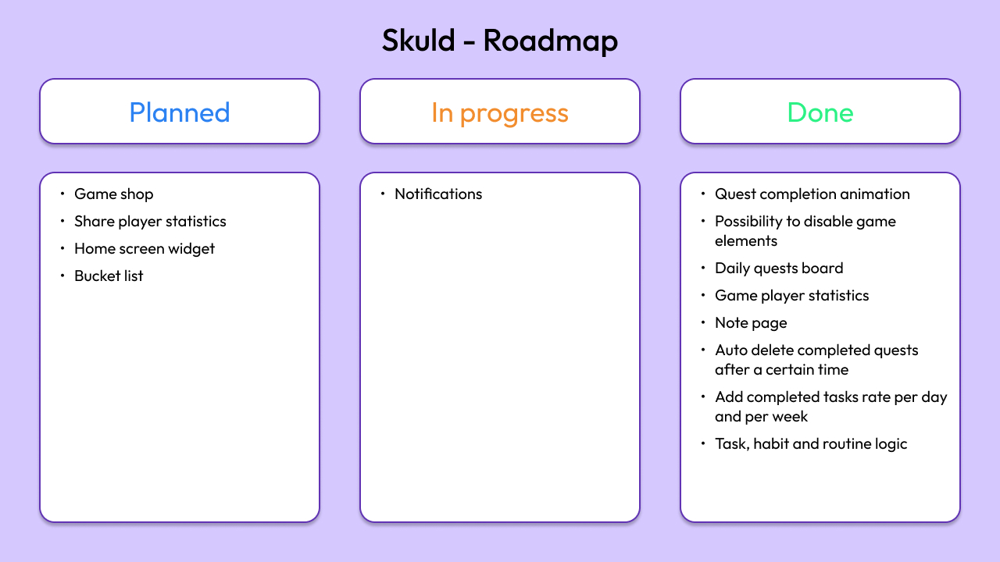

# Skuld

> October 2024

  

## I. Context

A gamify app for reminders, tasks and habits (quests). In the form of a boss-fighting RPG, the player embodies a hero who can be customized by eliminating bosses after completing a certain number of quests.

  
  

## II. Roadmap

  

## III. Project Status

- [X] Work in progress
- [ ] Work completed
